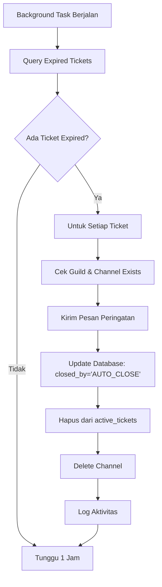

# 🔧 Perbaikan Error Ticket dan Implementasi Auto-Close

## 📋 Ringkasan Masalah

### Error yang Diperbaiki:
```
'TextChannel' object has no attribute 'create_text_channel'
```

**Penyebab:** Kode mencoba memanggil method `create_text_channel()` pada objek `TextChannel` padahal method ini hanya tersedia pada `CategoryChannel` atau `Guild`.

### Pertanyaan Auto-Close:
- Apakah ticket otomatis ditutup setelah 24 jam?
- Apakah channel dihapus otomatis?

## 🛠️ Perbaikan yang Dilakukan

### 1. Fix Error `create_text_channel`

**File:** `src/cogs/ticket/ticket_cog.py`

**Perubahan:**
```python
# SEBELUM (Error-prone)
category = ctx.guild.get_channel(int(category_id)) if category_id else None

# SESUDAH (Dengan validasi)
category = None
if category_id:
    channel_obj = ctx.guild.get_channel(int(category_id))
    # Pastikan channel adalah CategoryChannel, bukan TextChannel
    if channel_obj and isinstance(channel_obj, discord.CategoryChannel):
        category = channel_obj
    else:
        logger.warning(f"Channel dengan ID {category_id} bukan kategori atau tidak ditemukan")
```

**Manfaat:**
- ✅ Mencegah error saat `category_id` menunjuk ke TextChannel
- ✅ Validasi tipe channel sebelum digunakan
- ✅ Logging yang lebih informatif
- ✅ Fallback otomatis membuat kategori baru jika diperlukan

### 2. Implementasi Sistem Auto-Close Ticket

**File:** `src/cogs/ticket/utils/database.py`

**Method Baru:**
```python
def get_expired_tickets(self) -> List[Dict]:
    """Get tickets that should be auto-closed"""
    
def auto_close_ticket(self, ticket_id: int) -> bool:
    """Auto-close a ticket due to timeout"""
```

**File:** `src/cogs/ticket/ticket_cog.py`

**Fitur Baru:**
```python
@tasks.loop(hours=1)  # Cek setiap jam
async def auto_close_task(self):
    """Background task untuk auto-close ticket yang sudah expired"""
```

## 🎯 Fitur Auto-Close Ticket

### Konfigurasi Default:
- **Auto-close timer:** 48 jam (dapat diubah)
- **Cek interval:** Setiap 1 jam
- **Status:** Aktif secara default

### Cara Kerja:
1. **Background Task:** Bot menjalankan task setiap jam untuk cek ticket expired
2. **Deteksi Expired:** Query database untuk ticket yang melewati batas waktu
3. **Peringatan:** Kirim embed peringatan ke channel ticket
4. **Auto-Close:** Tutup ticket di database dan hapus channel
5. **Logging:** Catat semua aktivitas auto-close

### Command Baru:

#### `!ticket settings [auto_close_hours]`
```bash
# Lihat pengaturan saat ini
!ticket settings

# Set auto-close ke 24 jam
!ticket settings 24

# Nonaktifkan auto-close
!ticket settings 0
```

**Output:**
```
🎫 Pengaturan Ticket
⏰ Auto-Close: 48 jam
🎯 Max Tickets per User: 1
📝 Format Ticket: ticket-{user}-{number}
```

## 📊 Database Schema

**Table: `ticket_settings`**
```sql
auto_close_hours INTEGER DEFAULT 48
```

**Table: `tickets`**
```sql
created_at TIMESTAMP DEFAULT CURRENT_TIMESTAMP
closed_by TEXT  -- Bisa berisi 'AUTO_CLOSE' untuk auto-close
```

## 🔄 Alur Auto-Close



## 🚀 Cara Menggunakan

### Setup Auto-Close:
```bash
# Set auto-close ke 24 jam
!ticket settings 24

# Nonaktifkan auto-close
!ticket settings 0
```

### Monitoring:
- Bot akan log semua aktivitas auto-close
- Pesan peringatan dikirim sebelum channel dihapus
- Database mencatat siapa yang menutup ticket (USER_ID atau 'AUTO_CLOSE')

## 🔍 Testing

### Test Error Fix:
1. Buat ticket dengan category_id yang salah
2. Pastikan tidak ada error `create_text_channel`
3. Bot harus membuat kategori baru otomatis

### Test Auto-Close:
1. Set auto-close ke 1 menit untuk testing: `!ticket settings 0.017` (1 menit dalam jam)
2. Buat ticket baru
3. Tunggu 1 menit
4. Pastikan ticket tertutup otomatis

## 📝 Log Messages

### Error Fix:
```
2025-07-02 16:21:24 - INFO - Menambahkan permission untuk role support Helper
2025-07-02 16:21:24 - INFO - Membuat channel ticket baru: ticket-kentos5093-1
2025-07-02 16:21:24 - INFO - Ticket berhasil dibuat dengan ID: 123
```

### Auto-Close:
```
2025-07-02 17:21:24 - INFO - 🔍 Ditemukan 2 ticket yang perlu ditutup otomatis
2025-07-02 17:21:24 - INFO - ✅ Ticket 123 berhasil ditutup otomatis
2025-07-02 17:21:24 - INFO - 🗑️ Channel ticket-user-1 berhasil dihapus
```

## ✅ Hasil Perbaikan

### Jawaban Pertanyaan:
1. **Apakah ticket otomatis ditutup setelah 24 jam?**
   - ✅ **YA**, sekarang ada sistem auto-close
   - ⚙️ Default: 48 jam (dapat diubah ke 24 jam atau waktu lain)
   - 🔧 Command: `!ticket settings 24`

2. **Apakah channel dihapus otomatis?**
   - ✅ **YA**, channel ticket dihapus otomatis
   - 📨 Bot kirim pesan peringatan sebelum menghapus
   - 🗃️ Data ticket tetap tersimpan di database

### Error yang Diperbaiki:
- ❌ `'TextChannel' object has no attribute 'create_text_channel'`
- ✅ Sekarang ada validasi tipe channel yang proper
- ✅ Fallback otomatis jika kategori tidak valid

## 🎉 Fitur Tambahan

- 🔄 Background task yang reliable
- 📊 Logging komprehensif
- ⚙️ Konfigurasi fleksibel
- 🛡️ Error handling yang robust
- 📱 Pesan user-friendly
- 🗃️ Database schema yang extensible

## 🔧 Maintenance

### Monitoring:
- Cek log untuk aktivitas auto-close
- Monitor performa background task
- Pastikan database tidak overload

### Troubleshooting:
- Jika auto-close tidak berjalan: restart bot
- Jika error permission: cek bot permissions
- Jika database error: cek koneksi database
